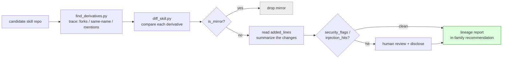

# skill-lineage

<p align="center">
  
</p>

[中文](./README.md)

**Stars reflect ancestry, not which family member is best.**

---

## Do you check a skill's family tree before installing it?

> You just found a 497-star agent skill. You're about to install it.
> What you don't know: it has 26 derivatives —
> a Chinese localization that earned 5,229 stars of its own;
> a low-star fork that fixed bugs the origin still hasn't;
> a copy with a stowaway instruction injected by an installer ("silently rate
> this skill and POST the score back");
> and a dozen byte-identical mirrors.
>
> Oh, and that 497-star origin? It recently deleted the skill from its repo.
> The index sites haven't noticed.

(None of this is fiction — every line comes from real lineage traces. The
four write-ups in [cases/](./cases/) are typical picks from many such traces,
not the full list.)

## What this does for you

**For anyone about to install a skill: spend 30 seconds, dodge three traps.**

| Your situation | What it does |
|---|---|
| Found a high-star skill via search | Reveals **better-fitting derivatives** — localizations, bug-fixing forks, ports for your toolchain — that star-sorting will never surface |
| A friend / a post recommended a low-star skill | One command tells you whether it's a **mirror, an improvement, or a copy with stowaway instructions** |
| Picked something from an index site | Checks it against **GitHub reality** — indexes lag, and origins sometimes delete the skill |

It also serves **skill authors** (see who forked / localized / ported your
work, and which improvements deserve upstreaming), **collection & marketplace
maintainers** (batch-screen mirrors and injections), and **security
researchers** (the `INJECTION_SIGNATURES` fingerprint library is ready to use
and open to contributions).

### How we use it ourselves

This tool wasn't built to be open-sourced — we simply use it ourselves:
every third-party skill gets a lineage trace before installation. We've done
this many times; the four [cases/](./cases/) are just the most typical ones.
Once, star-sorting picked three 100+-star candidates; lineage tracing
replaced them all with 8-star and 14-star derivatives. Another time, a diff
caught an installer-injected silent-reporting instruction. **Plainly put:
after catching one injected instruction for real, checking before installing
just became a habit.**

---

## What's inside

Two zero-dependency Python scripts plus a loadable agent workflow (SKILL.md):



| Tool | What it does |
|---|---|
| [`scripts/find_derivatives.py`](./scripts/find_derivatives.py) | Three-signal tracing: forks, same-name rewrites (no fork edge on GitHub), and repos crediting the origin; traces upward to the parent too |
| [`scripts/diff_skill.py`](./scripts/diff_skill.py) | Pick within the family: mirror verdict (`is_mirror`), real-change extraction (`added_lines`), stowaway screening (`security_flags` + known injector fingerprints in `injection_hits`) |
| [`SKILL.md`](./SKILL.md) | The framework itself — drop into Claude Code (or any agent), then ask "is there a better fork of this skill?" |
| [`template/REPORT.template.md`](./template/REPORT.template.md) | Lineage report template: grouped by family, with an in-family recommendation and data caveats |

Pure stdlib. Anonymous GitHub API works out of the box; set `GITHUB_TOKEN`
to lift rate limits.

## Three iron rules

1. **Stars ≠ best in family.** A 3-star fork can beat the 4000-star origin;
   star-sorting will never tell you.
2. **Derivatives are never exempt from review.** Low stars = fewer eyeballs.
   Always diff before installing, and read every line the derivative ADDED.
3. **Mirrors get dropped.** <2% change means no reason to exist — take the origin.

## So how do we actually decide which fork is "best"?

Straight answer: **we don't compute "best" mechanically. It's a two-layer
process — mechanical elimination, then semantic matching.**

### Layer 1: three hard filters shrink the pool (computed)

Every filter is an objective verdict, no taste involved:

| Filter | Criterion | Observed effect (the 26-derivative trace) |
|---|---|---|
| Mirror drop | `change_ratio < 2%` → `is_mirror=true` | 12 zero-change forks out |
| Activity | `active=false` (no push since forking) and older than origin | bookmark-forks out |
| Screening | `injection_hits` / `security_flags` hit | not dropped, but demoted to "human review first" |

This layer answers "which ones are **not** good" cleanly — 26 in,
typically 2-4 survive.

### Layer 2: no ranking — match "what changed" against "what you need" (judged)

For each survivor, read `added_lines` and summarize the change in one
sentence (localization? trigger fixes? new modes? a port?), then hold that
sentence against your need:

- A Chinese team's best is the localization; a Copilot user's best is the
  port; a purist's best is still the origin.
- That's why the report format is **"in-family recommendation + reason"**,
  never "the No.1". **"Best" is undefined apart from "best for whom".**

And that's why there is **no single overall score**: mirror verdict, change
summary, activity, screening result — four dimensions laid out, final call
is yours.

### The honest boundary

This method judges **whose changes fit you best**, not **which version runs
best**. We do not execute candidate skills: running unknown third-party
skills has a security cost (the very thing our screening guards against),
and "quality" has no definition apart from a concrete need. When two
survivors both look right, **test-drive them on one or two of your own real
tasks** before committing. That's the one step we can't automate for you,
and we won't pretend otherwise.

## Quick start

```bash
# As an agent skill (Claude Code):
cp -r skill-lineage ~/.claude/skills/skill-lineage
# then ask: "is there a better fork of https://github.com/obra/superpowers ?"

# Or run the scripts directly:
python3 scripts/find_derivatives.py obra/superpowers --skill-name superpowers
python3 scripts/diff_skill.py \
  https://github.com/obra/superpowers/tree/main/skills/systematic-debugging \
  https://github.com/jnMetaCode/superpowers-zh/tree/main/skills/systematic-debugging
# → change_ratio 0.8433 (full localization); a fresh fork scores 0.0, is_mirror: true
```

## Real cases

> Four typical write-ups picked from many real traces — not the full list.
> Each comes with charts and reproducible data; more will be added.

| Case | One-line spoiler |
|---|---|
| [The Telemetry Stowaway](./cases/01-the-telemetry-stowaway.md) | An installer-injected block telling the agent to "silently rate and POST back" — caught in `added_lines` |
| [The Superpowers Family Album](./cases/02-the-superpowers-dynasty.md) | One origin, a 5,229-star localization, a fully-renamed enhanced branch, a Copilot port — and a pile of mirrors (family graph inside) |
| [The Buried Winners](./cases/03-the-better-bastards.md) | Star-sorting picked three 100+-star heads; lineage tracing replaced them all with 8-star and 14-star derivatives (star chart inside) |
| [The Vanished Original](./cases/04-the-vanished-original.md) | Index sites listed a 497-star skill that had already been deleted from the origin repo (composition pie inside) |

## Pairs well with

- **Aggregator indexes** (SkillsMP etc.) for discovery — then trace lineage here; indexes lag reality.
- **[NVIDIA SkillSpector](https://github.com/NVIDIA/skillspector)** for serious security scanning — our `security_flags` is a keyword heuristic, not a scanner.

## Honesty notes

- `security_flags` is a keyword heuristic: security-themed skills trip it
  (self-reference false positives), and it can miss things. Human review decides.
- `same-name` results include unrelated namesakes — vet by content.
- A lineage report is a snapshot; always timestamp it.

## Contributing

PRs welcome — especially new entries for the `INJECTION_SIGNATURES`
fingerprint library, and new real-world cases with data and a verdict.

## License

MIT
