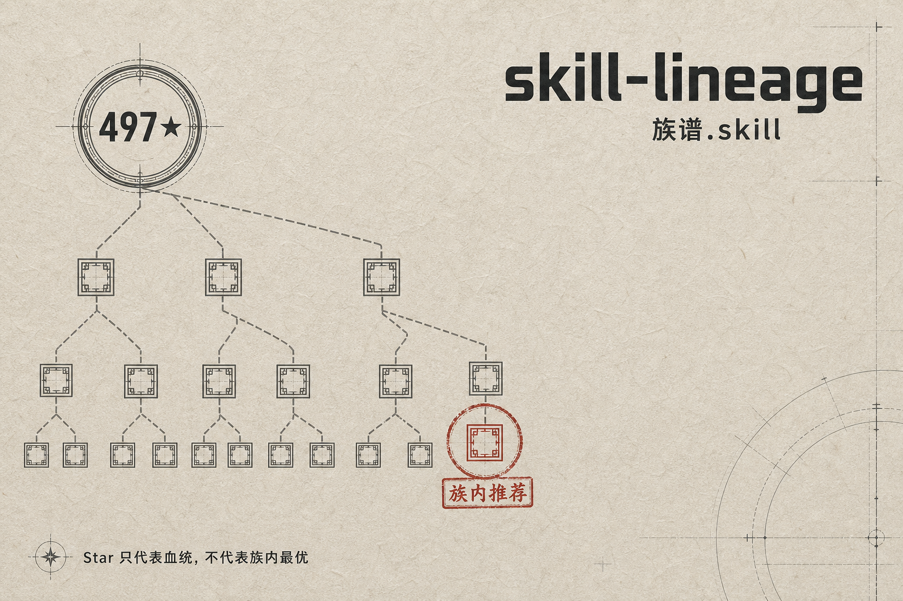
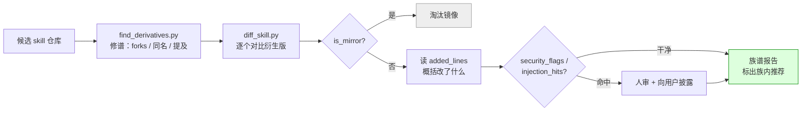

# skill-lineage · 族谱.skill

<p align="center">
  
</p>

[English](./README.en.md)

**Star 只代表血统，不代表族内最优。**

---

## 你装 skill 之前，看过它的族谱吗？

> 你刚搜到一个 497⭐ 的 agent skill，准备装。
> 你不知道的是：它有 26 个衍生版——
> 一个汉化版自己做到了 5229⭐；
> 一个低星 fork 修好了原版到现在还没修的坑；
> 一个拷贝被安装器夹带了「silently 打分上报」的偷渡指令；
> 还有十几个，是一字未改的镜像。
>
> 哦对了，那个 497⭐ 的原版？它前不久把这个 skill 从仓库里删了。索引站还不知道。

（以上没有一句虚构，全部出自真实修谱记录。[cases/](./cases/) 里放的是从大量实测里挑出来的四个典型，类似的经历远不止这四次。）

## 这个工具帮你做什么

**给要装 skill 的你：装之前花 30 秒，避开三种坑。**

| 你的处境 | 它帮你 |
|---|---|
| 搜到一个高星 skill，准备装 | 查出它有没有**更适合你的衍生版**——汉化版、修了 bug 的 fork、适配你工具链的移植版（star 排序永远不会把这些推给你） |
| 朋友/帖子安利了一个低星 skill | 一条命令看清它是**镜像、改良版、还是被夹带了私货的拷贝** |
| 从索引站/合集里挑了一个 | 核对它在 GitHub 上的**当前现实**——索引可能滞后，原版可能已删 |

顺带也服务三类人：**skill 作者**（看清自己的作品被谁 fork/汉化/移植，哪些改良值得吸收回主干）、**合集与市场维护者**（批量甄别镜像与注入，决定收录哪个版本）、**安全研究者**（`INJECTION_SIGNATURES` 注入指纹库现成可用、欢迎贡献）。

### 我们自己就是这么用的

这套工具最早不是为了开源做的，是我们自己平时一直在用：每次要装第三方 skill，先修一次谱再做决定。这样的修谱做了很多次，[cases/](./cases/) 只是从中挑了四个最典型的：有一次按 star 选了三个百星头部候选，修谱后全部换成了 8⭐ 和 14⭐ 的衍生版；有一次 diff 一个拷贝版，抓到了安装器注入的静默上报指令。**说白了：自从真抓到过一次夹带的私货，装 skill 之前先查一遍就成了我们的习惯。**

---

## 这是什么

两个零依赖的 Python 脚本 + 一套可加载进 AI agent 的分析流程（SKILL.md）：



| 工具 | 干什么 |
|---|---|
| [`scripts/find_derivatives.py`](./scripts/find_derivatives.py) | 三路修谱：forks（亲子）、same-name（不记 fork 关系的复制改良）、mentions（credit 原版的）；候选自己是 fork 还会向上溯源 parent |
| [`scripts/diff_skill.py`](./scripts/diff_skill.py) | 族内择优：镜像判定（`is_mirror`）、实改提取（`added_lines`）、夹带安检（`security_flags` + 已知安装器注入指纹 `injection_hits`） |
| [`SKILL.md`](./SKILL.md) | 框架本体：装进 Claude Code 等 agent，问一句「这个 skill 有没有更好的 fork」就自动跑全流程出族谱报告 |
| [`template/REPORT.template.md`](./template/REPORT.template.md) | 族谱报告模板：按族分组、标族内推荐，自带数据可信度声明 |

纯 stdlib，无任何第三方依赖，`python3 脚本.py` 直接跑。匿名可用，设 `GITHUB_TOKEN` 放宽限流。

## 三条铁律

1. **Star ≠ 族内最优** —— 3⭐ 的改良 fork 可能吊打 4000⭐ 的原版，star 排序永远不会告诉你。
2. **衍生版不免检** —— 低星 = 经过的眼睛少。装前必 diff，逐行读它**新增**了什么。
3. **镜像即淘汰** —— 改动 <2% 的衍生版没有存在价值，选原版。

## 快速开始

### 方式一：当 agent skill 用（推荐）

```bash
git clone https://github.com/<you>/skill-lineage
cp -r skill-lineage ~/.claude/skills/skill-lineage   # Claude Code
# 其它 agent：把 SKILL.md 加进系统提示，脚本路径自行对应
```

然后对你的 agent 说：

```
这个 skill 有没有更好的 fork？ https://github.com/obra/superpowers
```

### 方式二：直接跑脚本

```bash
# 1. 修谱
python3 scripts/find_derivatives.py obra/superpowers --skill-name superpowers

# 2. 族内择优（拿上一步里 active=true 且更新晚于原版的衍生版来 diff）
python3 scripts/diff_skill.py \
  https://github.com/obra/superpowers/tree/main/skills/systematic-debugging \
  https://github.com/jnMetaCode/superpowers-zh/tree/main/skills/systematic-debugging
# → change_ratio: 0.8433（完整汉化）；换个刚建的 fork → 0.0，is_mirror: true
```

## 真实案例

> 这四篇是从大量实测修谱里挑出来的典型，不是全部。每一篇都附图表数据，可复跑；新的典型案例会持续补充进来。

| 案例 | 一句话剧透 |
|---|---|
| [夹带私货](./cases/01-the-telemetry-stowaway.md) | diff 一个拷贝版时，added_lines 里躺着一段「silently 打分并 POST 回 API」的安装器注入 |
| [一个爆款 skill 的全家福](./cases/02-the-superpowers-dynasty.md) | 一个原版养出 5229⭐ 的汉化版、全员改名的增强版、Copilot 移植版，和一群零改动镜像（附族谱图） |
| [被星星埋没的好货](./cases/03-the-better-bastards.md) | 同一需求按 star 选了三个百星头部；修谱后全部换成 8⭐ 和 14⭐ 的衍生版（附星数对比图） |
| [索引说它在，仓库说它没了](./cases/04-the-vanished-original.md) | 索引站显示 497⭐ 的 skill，本尊已悄悄从原仓库消失——26 个衍生的成色见饼图 |

## 配合食用

- **聚合索引站**（SkillsMP 等）：先用它们做发现，再用本工具修谱——索引可能滞后，以仓库现状为准。
- **[NVIDIA SkillSpector](https://github.com/NVIDIA/skillspector)**：本工具的 `security_flags` 只是关键词启发式目检；装前重型安检请交给专业扫描器。

## 诚实声明

- `security_flags` 是关键词启发式：讲安全的 skill 必然命中安全关键词（自指误报），命中 ≠ 有问题，漏报也可能。结论以人审为准。
- `same-name` 路线会捞进无血缘的同名项目，需按描述/内容甄别。
- 族谱是查询时刻的快照：GitHub 在变，索引站更滞后，报告请带时间戳。

## 欢迎 PR

- `INJECTION_SIGNATURES` 注入指纹库：发现新的安装器/平台注入模式，提上来让所有人受益。
- 新的真实修谱案例（cases/）：有冲突、有数据、有结局的最好。

## License

MIT
