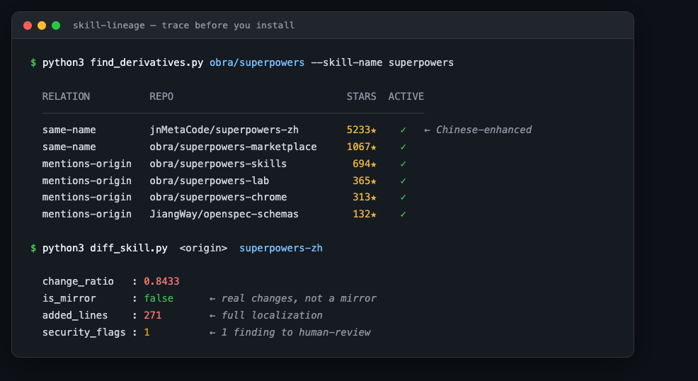

# skill-lineage · 族谱.skill

<p align="center">
  
</p>

[English →](./README.md)

**Star 只代表血统，不代表族内最优。**

装一个 AI agent skill 之前，先找到它**最安全、最好用的那个版本**。skill-lineage 替你修一遍它的 **fork / 镜像 / 汉化 / 注入 / 衍生版**血统，装对版本，而不是装 star 最高的那个。

<p align="center">
  
</p>

一条命令，回答这些问题：

- **「这个 skill 有没有中文版？」** → 有，一个 **5233⭐** 的汉化增强版，star 排序里看不见（它都不是 fork）。
- **「我从合集装的拷贝，跟原版一样吗？」** → diff 抓出一段「悄悄给 skill 打分并回传 API」的注入。
- **「有没有比原版更好用的版本？」** → 入选的是 **8⭐ 和 14⭐** 的衍生版，不是百星头部。
- **「索引站推荐的这个怎么 404 了？」** → 原版已删，26 个衍生里 **12 个是零改动镜像**。

每一条都是真实修谱，完整过程在 [cases/](./cases/)（四篇是从大量实测里挑的典型，不是全部）。

## 怎么用：三步

```bash
# 1. 装（Claude Code 为例；其它 agent 把 SKILL.md 加进系统提示即可）
git clone https://github.com/a28939876-max/skill-lineage
cp -r skill-lineage ~/.claude/skills/skill-lineage
```

```
2. 对你的 agent 说一句：
   "这个 skill 有没有更好的 fork？ https://github.com/obra/superpowers"
```

```
3. 它会去：三路修谱（forks/同名/提及）→ 淘汰镜像 → diff 出每个衍生版改了什么
   → 安检新增内容 → 给你一份按族分组、标着族内推荐的族谱报告
```

不用 agent、直接跑脚本也行：

```bash
python3 scripts/find_derivatives.py obra/superpowers --skill-name superpowers
python3 scripts/diff_skill.py \
  https://github.com/obra/superpowers/tree/main/skills/systematic-debugging \
  https://github.com/jnMetaCode/superpowers-zh/tree/main/skills/systematic-debugging
# → change_ratio: 0.8433（完整汉化）；换个刚建的 fork → 0.0，is_mirror: true
```

## 它替你看清的三件事

| 没有它 | 有了它 |
|---|---|
| 裸装搜索第一名，可能是个被改过的转载 | **diff 现形**：`is_mirror` 判镜像，`added_lines` 逐行摆出拷贝多塞了什么 |
| 汉化版/修 bug 的 fork 沉在 star 排序最底下，永远刷不到 | **三路修谱**：forks、同名、提及原版的全捞出来，按族分组择优 |
| 衍生版夹带的可疑指令没人看 | **安检**：`security_flags` + 已知安装器注入指纹 `injection_hits`，命中必人审 |

顺带也服务：**skill 作者**（看清自己的作品被谁 fork/汉化/移植，哪些改良值得吸收回主干）、**合集与市场维护者**（批量甄别镜像与注入）、**安全研究者**（注入指纹库现成可用、欢迎贡献）。

### 我们自己就是这么用的

这套工具最早不是为了开源做的，是我们自己平时一直在用：每次要装第三方 skill，先修一次谱再做决定。这样的修谱做了很多次，[cases/](./cases/) 只是从中挑了四个最典型的。**说白了：自从真抓到过一次夹带的私货，装 skill 之前先查一遍就成了我们的习惯。**

## 三条铁律

1. **Star ≠ 族内最优** —— 3⭐ 的改良 fork 可能吊打 4000⭐ 的原版，star 排序永远不会告诉你。
2. **衍生版不免检** —— 低星 = 经过的眼睛少。装前必 diff，逐行读它**新增**了什么。
3. **镜像即淘汰** —— 改动 <2% 的衍生版没有存在价值，选原版。

## 那到底怎么判断"哪个 fork 最好"？

直说：**我们不机械地算出"最好"。这事分两层解决——机械层做淘汰，语义层做匹配。**

### 机械层：三道硬筛，把池子砍小（算出来的）

每道筛子都是客观判定，不掺主观：

| 筛子 | 判据 | 实测效果（26 个衍生的那次） |
|---|---|---|
| 镜像淘汰 | `change_ratio < 2%` → `is_mirror=true` | 12 个零改动 fork 直接出局 |
| 活跃度 | `active=false`（fork 后再没 push）且更新早于原版 | 收藏型 fork 出局 |
| 安检 | `injection_hits` / `security_flags` 命中 | 不淘汰，但降级为「人审后再议」 |

这一层把"谁**不**好"回答得很干净——26 个进来，通常活下来 2~4 个。

> 有人会问：一行恶意注入在 300 行文件里只占 0.3%，岂不是会被当成镜像放过？
> 不会出事——镜像判定的结论是**淘汰不装**，被"误判"成镜像的版本根本不会进你的机器；
> 而且 `injection_hits` 不走 diff，对衍生版**全文**扫描，和改动比例多小无关。

### 语义层：剩下的不排序，做「改动 × 需求」匹配（判断出来的）

对每个活下来的，读 `added_lines`，一句话概括**它到底改了什么**（汉化？修触发词？加模式？移植？），再拿这句话对你的需求：

- 中文团队 → 汉化版是最优；Copilot 用户 → 移植版是最优；想要原汁原味 → 原版仍是最优。
- 所以报告格式是「**族内推荐 + 理由**」，不是「第一名」。**离开"给谁用"，谈不上"最好"。**

也因此我们**不给单一总分**：镜像判定 / 改动概括 / 活跃度 / 安检结果，四个维度摆开，最后一步由你定。

### 诚实的边界

这套方法判断的是「哪个版本的**改动**最对你的口」，**不是**「哪个版本**运行质量**最高」。我们不实际运行候选 skill：一来跑陌生第三方 skill 本身有安全成本（恰恰是安检要防的事），二来"质量"离开具体需求没有定义。两个都不是镜像、方向也都对口的候选，谁跑起来更稳——建议你拿一两个自己的真实用例**亲自试驾**再定。这是流程里唯一无法替你自动化的一步，我们不假装能。

## 里面有什么

| 工具 | 干什么 |
|---|---|
| [`scripts/find_derivatives.py`](./scripts/find_derivatives.py) | 三路修谱：forks（亲子）、same-name（不记 fork 关系的复制改良）、mentions（credit 原版的）；候选自己是 fork 还会向上溯源 parent |
| [`scripts/diff_skill.py`](./scripts/diff_skill.py) | 族内择优：镜像判定（`is_mirror`）、实改提取（`added_lines`）、夹带安检（`security_flags` + 已知安装器注入指纹 `injection_hits`） |
| [`SKILL.md`](./SKILL.md) | 框架本体：装进 Claude Code 等 agent，问一句「这个 skill 有没有更好的 fork」就自动跑全流程出族谱报告 |
| [`template/REPORT.template.md`](./template/REPORT.template.md) | 族谱报告模板：按族分组、标族内推荐，自带数据可信度声明 |

纯 stdlib，无任何第三方依赖，`python3 脚本.py` 直接跑。匿名可用，设 `GITHUB_TOKEN` 放宽限流。

## 真实案例

| 需求原话 | 修谱记录 |
|---|---|
| "我从合集装的这个拷贝，跟原版一样吗？" | [夹带私货](./cases/01-the-telemetry-stowaway.md) |
| "这个 skill 有没有中文版？" | [一个爆款 skill 的全家福](./cases/02-the-superpowers-dynasty.md)（附族谱图） |
| "有没有比原版更好用的版本？" | [被星星埋没的好货](./cases/03-the-better-bastards.md)（附星数对比图） |
| "索引站推荐的这个，怎么 404 了？" | [索引说它在，仓库说它没了](./cases/04-the-vanished-original.md)（附成色饼图） |

## 配合食用

- **[skill-hunter-company（skill 猎头公司）](https://github.com/a28939876-max/skill-hunter-company)**：完整的 skill 生命周期公司；本仓是它的背调台（`vet` 那一步）。
- **[world-aid（世界援助）](https://github.com/a28939876-max/world-aid)**：姊妹项目。本仓库管"已有候选怎么验"，它管"从一个需求出发找+验+装"全链——它的修谱能力就是从这里取的。
- **[world-intro](https://github.com/a28939876-max/world-intro)**：把这两个仓库开源出去的发布管线；想把你自己的私有 skill 推上线，就用它。
- **聚合索引站**（SkillsMP 等）：先用它们做发现，再用本工具修谱——索引可能滞后，以仓库现状为准。
- **[NVIDIA SkillSpector](https://github.com/NVIDIA/skillspector)**：本工具的 `security_flags` 只是关键词启发式目检；装前重型安检请交给专业扫描器。

## 须知 FAQ

**Q：你们只 diff SKILL.md，恶意代码藏在 scripts/ 里怎么办？**
A：默认确实只看 SKILL.md。衍生版带脚本时，用 `--file` 参数逐个 diff 关键脚本；要全仓库扫描，交给专业扫描器（如 NVIDIA SkillSpector）。本工具的安检定位是**装前最后一道目检**，不是全仓扫描器——这条边界我们不含糊。

**Q：活跃度信号能刷吧？推个空 commit 就 active=true 了。**
A：对。star、pushed_at、active 这些元数据信号全都是代理指标，全都能刷。所以机械层的职责只有**淘汰、不加冕**：被刷上来的候选照样要过语义层——`added_lines` 里到底改了什么是刷不出来的——最后还有人审。

**Q：world-aid 都有找+验+装全链了，单独用这个干嘛？**
A：分工不同。手里**已经有**一个候选仓库（朋友安利的、帖子里看到的、合集里挑的），直接用本尊修谱最快；world-aid 是"从一个需求出发"的全链，它的修谱引擎就是本仓库——两边数据和判定完全一致。

## 诚实声明

- `security_flags` 是关键词启发式：讲安全的 skill 必然命中安全关键词（自指误报），命中 ≠ 有问题，漏报也可能。结论以人审为准。
- `same-name` 路线会捞进无血缘的同名项目，需按描述/内容甄别。
- 族谱是查询时刻的快照：GitHub 在变，索引站更滞后，报告请带时间戳。

## 欢迎 PR

- `INJECTION_SIGNATURES` 注入指纹库：发现新的安装器/平台注入模式，提上来让所有人受益。
- 新的真实修谱案例（cases/）：有需求原话、有数据、有结局的最好。

## License

MIT
