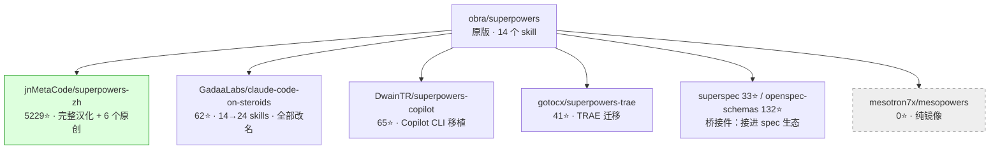

# 案例二：一个爆款 skill 的全家福 / The Superpowers Family Album

> 一个原版，养出一个 5229⭐ 的汉化版、一个全员改名的增强版、一个 Copilot 移植版，和一群一字未改的镜像。

## 族树（实测快照）

对 `obra/superpowers`（Claude Code 最著名的 skill 合集之一）跑 `find_derivatives.py`：

两次 `diff_skill.py` 实测（同一个 skill 文件 `systematic-debugging`）：

| 对比对象 | change_ratio | is_mirror | 改动概括 |
|---|---|---|---|
| 原版 vs superpowers-zh | **0.8433** | false | 逐行翻译，结构未动 → 中文用户的族内推荐 |
| 原版 vs mesopowers | **0.0** | **true** | 一字未改 → 淘汰 |

## 这个族证明了什么

1. **「族内最优」取决于你是谁。** 中文团队的最优是 superpowers-zh（它自己就 5229⭐——衍生版做大不是奇迹）；Copilot 用户的最优是 DwainTR 的移植；原教旨用户的最优仍是原版。**不存在脱离使用者的"最好版本"。**
2. **same-name 路线不可省。** superpowers-zh 不是 fork——GitHub 的 fork 图谱里根本没有它。只看 forks 你会以为这个族只有镜像。
3. **衍生有三种**：改良（steroids）、移植（copilot/trae）、桥接（superspec）。修谱时别只盯着"改了原文件的"。
4. **改名是 diff 的天敌。** steroids 把 24 个 skill 全部重命名，与原版零路径交集——这时 `diff_skill.py` 会 404，正确动作是退回 trees API 做名字映射，或降级读 README 概括改动。
5. **镜像判定干净利落。** 刚建不久的 fork 一字未改：change_ratio 精确为 0.0。这种衍生版不需要任何讨论。

## 数据来源

- `find_derivatives.py obra/superpowers --skill-name superpowers`
- `diff_skill.py` 实测两对：origin vs superpowers-zh（0.8433）、origin vs mesopowers（0.0）
- GitHub trees API 交集验证：origin 14 个 SKILL.md vs steroids 24 个，交集 0。
