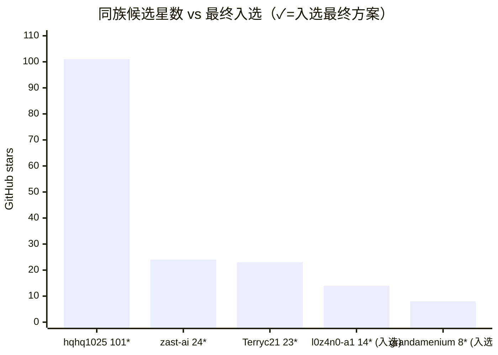

# 案例三：被星星埋没的好货 / The Buried Winners

> 同一个需求搜两遍：按 star 排序选出来的，和修谱之后选出来的，完全不是同一批。

## 背景

需求：「找一个能打磨/审查已装 skill 的 skill」。

**第一遍（v1，按 star 排序）**：选出三个头部候选——某中文六维度审查器、某 skill-reviewer、某知名作者的 skill-optimizer。都是各自搜索结果里星数最高的，看起来稳。

**第二遍（v2，对头部候选修谱）**：对 v1 的三个头部各跑一次 `find_derivatives.py`，同名搜索捞出 **10+ 个 v1 报告里根本没出现的项目**——它们在 star 排序里沉底，或压根不在前几页。

## 修谱捞出来的赢家

| 项目 | 星数 | 凭什么赢 |
|---|---|---|
| grandamenium/skill-optimizer | **8⭐** | 不做静态评分，直接读 agent 运行的 JSONL transcript，对照 SKILL.md 找「实际执行哪里没按 skill 走」——解决了静态审查对编排型 skill 无从下手的死穴 |
| l0z4n0-a1/anthropic-grade-optimizer | **14⭐** | 对照 189 条带引用的官方规则、11 个维度审计，按模型校准，每条发现附原文出处 |
| hqhq1025/skill-optimizer | 101⭐ | 原作者本人的重构三件套——靠一个合集拷贝 frontmatter 里的 `source:` 字段顺藤摸到 |

同族成员星数一字排开——星数和最终是否入选，几乎是反着来的：

最终方案用的是 **8⭐ + 14⭐ 的组合拳**，v1 的百星头部一个没留。

## 教训

1. **star 排序系统性歧视新改良版**——衍生版起步晚、曝光少，star 永远追不上原版，但它们站在原版的肩膀上。
2. **同名搜索（same-name）是捞沉底货的唯一路径**：这些项目多数不是 fork，fork 图谱看不见它们。
3. **`source:` / credits 字段是免费的血统线索**：合集仓库的拷贝常常老老实实写着来源，读 frontmatter 比跑 API 还便宜。
4. 低星赢家仍要过铁律二：两个最终入选项目都在装前通读了 SKILL.md 与全部脚本。

## 数据来源

- 本篇是众多实测修谱记录里挑出的典型之一。
- 同一需求 v1/v2 两份猎取报告对照，v2 为谱系感知重跑。
