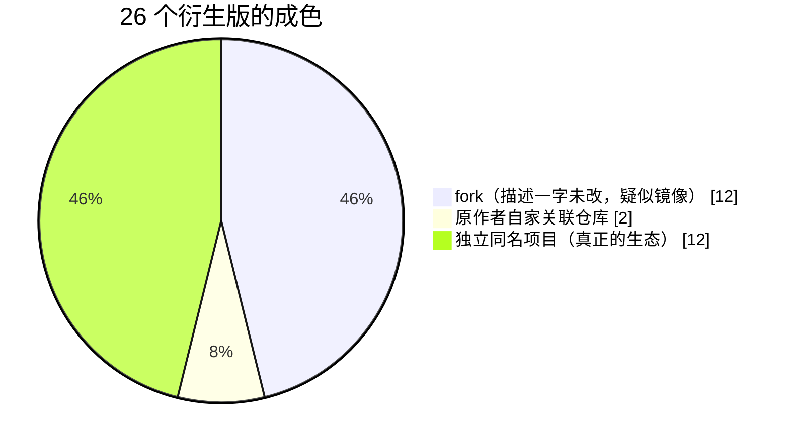

# 案例四：索引说它在，仓库说它没了 / The Vanished Original

> 需求原话：「索引站推荐的这个，怎么 404 了？」
> 答案：索引站说它有 497⭐ 和一窝衍生版，但它已经不在原仓库里了。

## 事情经过

某天上午，聚合索引站还显示 `aaronjmars/aeon` 仓库里有个 `skill-security-scan`（497⭐，描述完整），且已形成 5+ 成员的衍生族。

当天下午修谱验证，索引快照和仓库现实对不上了：

| | 索引站快照 | 仓库现实（修谱时） |
|---|---|---|
| `skills/skill-security-scan/` 路径 | 存在，描述完整 | **404**（trees API 全量核对：已改名或移除） |
| 原仓库星数 | 497⭐ | 507⭐（还在涨，但 skill 没了） |
| 衍生族 | 5+ 成员 | 26 个，但成色见下图 |

`find_derivatives.py` 拉到的 26 个衍生，构成是这样的：



真正有信息量的反而是 `same-name` 路线捞出的独立同名生态——与 aeon 毫无 fork 关系：

```
 ├─ huifer/skill-security-scan（149⭐）：中文 CLI，装前扫描工具
 ├─ senaykt/iac-security-scan-skills（42⭐）：IaC 方向特化
 ├─ caidongyun/agent-security-skill-scanner（26⭐）
 └─ …另有 9 个同名小项目
```

## 教训

1. **索引站是快照，GitHub 是现实。** 聚合站可能滞后数天到数周；装之前永远以仓库当前状态为准，404 ≠ 你输错了路径，可能是它真没了。
2. **fork 数看着热闹，其实最不可靠。** fork 按钮一秒就能点，这 12 个 fork 的描述全是零改动——用 is_mirror 一判就现了原形。
3. **same-name 这条路又一次派上用场**：当原版自己都不稳定时，独立同名生态（149⭐ 的中文实现）可能才是真正可装的选择。
4. 修谱报告必须带**查询时间戳**（见 template 的 Data caveats 节）——族谱是某一时刻的快照，不是永久事实。

## 数据来源

- 本篇是众多实测修谱记录里挑出的典型之一。
- `find_derivatives.py aaronjmars/aeon --skill-name skill-security-scan`
- raw 直链 main/master 双 404 + trees API 全量路径核对。
